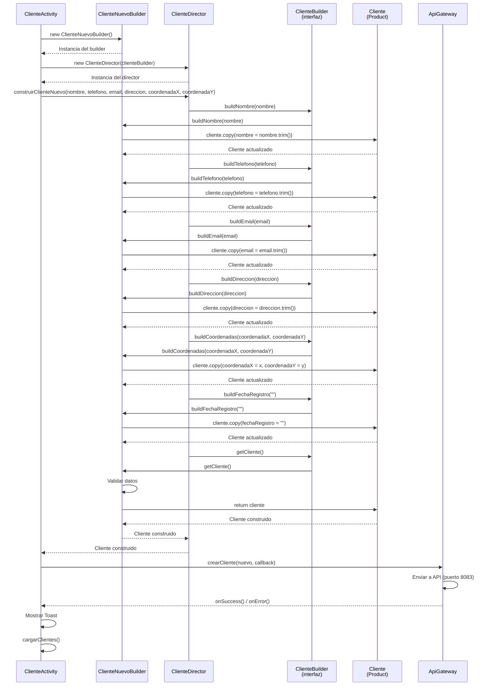
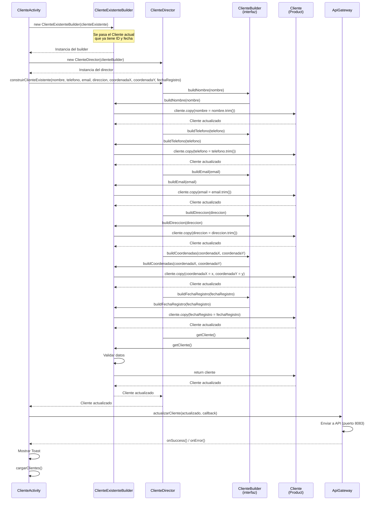
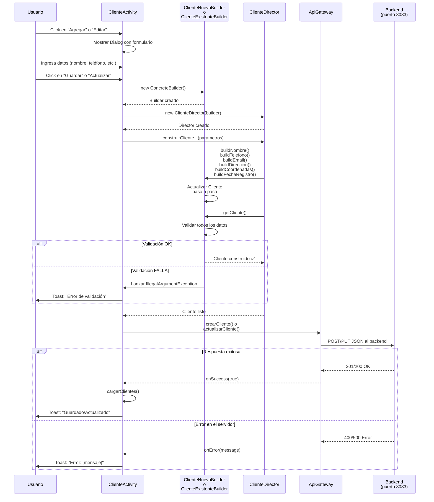
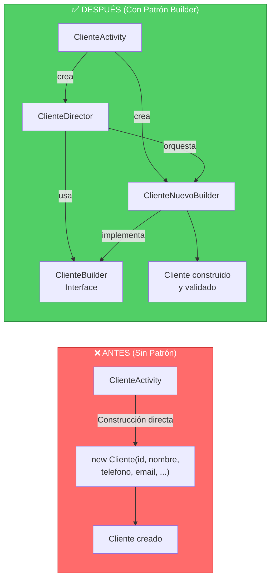

## 🔄 Diagrama de Secuencia - Patrón Builder Cliente

### 1️⃣ Crear Cliente Nuevo



---

### 2️⃣ Actualizar Cliente Existente



---

### 3️⃣ Flujo Completo (Visión General)



---

### 4️⃣ Comparación: Antes vs Después del Patrón



---

### 📝 Notas del Diagrama de Secuencia

**En la creación de un Cliente Nuevo:**
1. Se crea `ClienteNuevoBuilder` (sin parámetros)
2. Se crea `ClienteDirector` con el builder
3. El Director orquesta los pasos de construcción
4. Cada paso actualiza el Cliente usando `copy()`
5. Al final se valida todo en `getCliente()`
6. Se envía la API si la validación es OK

**En la actualización de un Cliente Existente:**
1. Se crea `ClienteExistenteBuilder` pasando el cliente actual
2. Mantiene el `id` y `fechaRegistro` del original
3. Actualiza solo los campos modificados
4. Mantiene la misma orquestación del Director

**Validaciones:**
- Ocurren en el método `getCliente()` de cada builder
- Lanzan `IllegalArgumentException` si hay error
- Se capturan en `ClienteActivity` con try-catch
- Se muestran al usuario como Toast

---

### 🔄 Método Builder (El flujo principal)

```
ClienteActivity
    ↓
[1] Crear Builder Concreto
    ↓
ClienteNuevoBuilder() o ClienteExistenteBuilder()
    ↓
[2] Crear Director
    ↓
ClienteDirector(builder)
    ↓
[3] Orquestar Construcción
    ↓
director.construirClienteNuevo(...) 
director.construirClienteExistente(...)
    ↓
    ├─ buildNombre()
    ├─ buildTelefono()
    ├─ buildEmail()
    ├─ buildDireccion()
    ├─ buildCoordenadas()
    └─ buildFechaRegistro()
    ↓
[4] Validar y Obtener
    ↓
builder.getCliente()
    ↓
[5] Usar Cliente
    ↓
apiGateway.crearCliente() o actualizarCliente()
```

El patrón **está perfecto y completo**. 🚀
